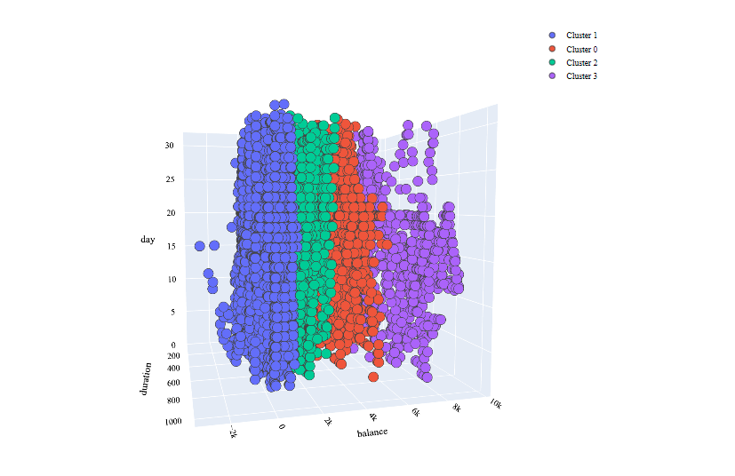

# Term Deposit Marketing Machine Learning model
This is a repository for Term Deposit Marketing machine learning model. Its goal is to improve the success rate for calls made to customers for any product.
## Description
The main objective of this project is to develop a robust machine learning system that leverages information coming from call center data. The goal of the model is to improve the success rate for calls made to customers for any product that the clients offer.
The model aims then to offer high success outcomes and interpretability for clients to make an informed decision.
Therefore, the used data comes from a campaign that involves making a phone call to a customer, often multiple times to ensure a term deposit subscription. Term deposits are usually short-term deposits with maturities ranging from one month to a few years. The customer must understand when buying a term deposit that they can withdraw their funds, only after the term ends.
The notebook demonstrates how did I use Machine Learning as well as Exploratory Data Analysis techniques to help the company much classify its customers, and then make pertinent decisions.    
#### For more details, see the notebook: **Term_Deposit_Marketing-virtualenv.ipynb**      
> The following image represents the last missed plot in the notebook:

## Requirements
Because this project uses some libraries that need special versions of python as for other modules, it would be better to create a virtual environment. Assuming that you have Anaconda installed. 
To do this:
* Open Anaconda Prompt from the desktop.
* Create a Virtual environment with the following command:    
### **conda create -n yourenvname python=3.6** 
* Activate your env: 
### **conda activate yourenvname**
* Luch Jupyter notebook with the command:
### **jupyter notebook**
* Open a new jupyter notebook.
* Install required packages with the following command:      
### **pip install -r requirements.txt**
